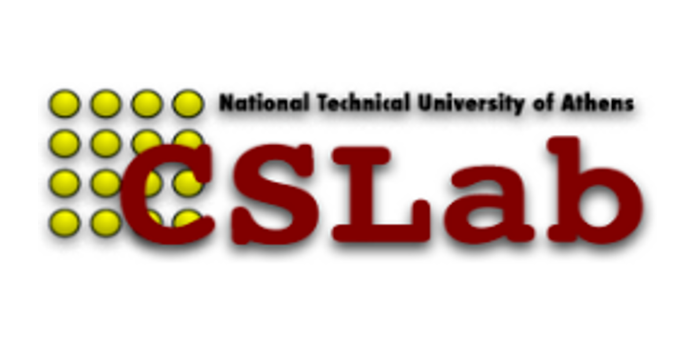
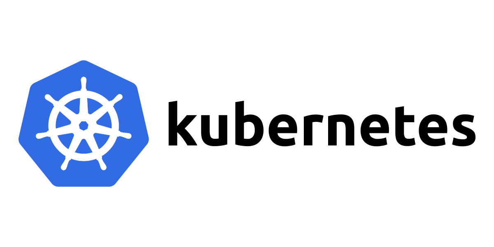

# NTUA ECE Diploma Thesis  

This is the repo of my diploma thesis, titled "**Extensions for Scheduling and
Autoscaling on Kubernetes Clusters with Local Storage Considerations**".

The thesis was conducted at the [Computer Systems
Laboratory](http://www.cslab.ntua.gr/) of the School of
Electrical & Computer Engineering, National Technical University of Athens, in
cooperation with [Arrikto](https://www.arrikto.com/) Inc.

You can read the final thesis text [here](thesis-template/thesis.pdf).

Grigoris P. Thanasoulas  
Electrical and Computer Engineer, MEng

Athens, July 2022

  
  
  

